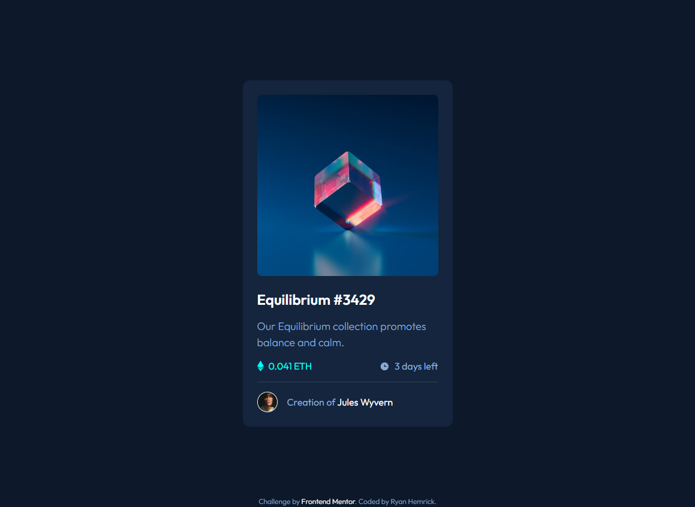

# Frontend Mentor - NFT preview card component solution

This is a solution to the [NFT preview card component challenge on Frontend Mentor](https://www.frontendmentor.io/challenges/nft-preview-card-component-SbdUL_w0U). Frontend Mentor challenges help you improve your coding skills by building realistic projects. 

## Table of contents

- [Overview](#overview)
  - [The challenge](#the-challenge)
  - [Screenshot](#screenshot)
  - [Links](#links)
- [My process](#my-process)
  - [Built with](#built-with)
  - [What I learned](#what-i-learned)
- [Author](#author)

## Overview
- A responsive 'NFT preview card' component built with HTML & CSS

### The challenge
- Build out this 'NFT preview card' component to match the provided design spec

### Screenshot

### Links
- Live Site URL: https://coruscating-ganache-3cc0df.netlify.app

## My process
- Utilized *CSS Grid* on the **body** element to horizontally and vertically center the NFT preview card (the grid item)
 

### Built with
- Semantic HTML5 markup
- CSS custom properties
- CSS Grid
- Flexbox
- Mobile-first approach to CSS

## Author
- Ryan Hemrick